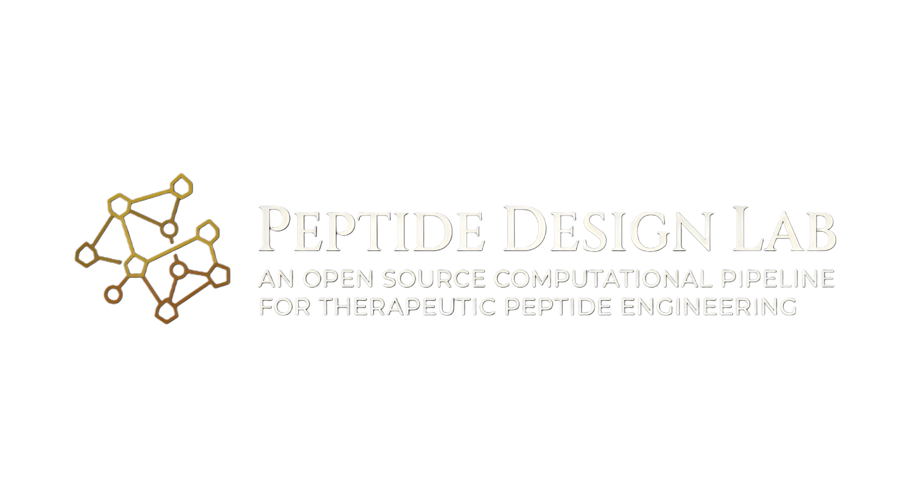

  

# 🧬 Peptide Design Lab

An advanced, end-to-end biomedical platform for the discovery, visualization, and AI-driven enrichment of bioactive peptides. This monorepo integrates a high-performance React frontend, a FastAPI-based AI intelligence layer, and an automated data processing pipeline.

---

## 🏛️ Project Architecture

The **Peptide Design Lab** is structured into three primary modules:

### 1. 🖥️ Web Client (`/web_client`)
A minimalist, 'editorial' style dashboard designed for high-impact scientific visualization.
- **Dual-View Interface:** Seamlessly toggle between the **Interconnected Mindmap** (spatial relationships) and the **Academic Research Wiki** (dense scientific documentation).
- **Interactive Peptide Canvas:** High-contrast visualization of amino acid sequences and genetic mapping (mRNA, Coding DNA, Template DNA).
- **Real-time AI Integration:** Dynamic fetching of biophysical property predictions.

### 2. 🧠 Intelligence Layer (`/intelligence_layer`)
A high-performance **FastAPI** backend serving as the AI core, deployed via Docker.
- **Model:** Meta's **ESM-2** (`facebook/esm2_t6_8M_UR50D`) transformer for deep protein sequence understanding.
- **Biophysical Profiling:** Real-time prediction of molecular weight, isoelectric point (Bjellqvist scale), hydrophobicity (Kyte-Doolittle), and serum stability scores.

### 3. ⚙️ Core Engine (`/core_engine`)
The automated data processing and enrichment heartbeat.
- **Automated Retrieval:** High-throughput scraping of **PubChem** (PUG REST/View) for bioactive peptides.
- **Biomedical Enrichment:** A custom string synthesis engine that generates professional clinical descriptions, molecular targets, and side effect profiles.
- **Genetic Transcription:** Transcribes amino acid sequences into human-optimized genetic strands for expression modeling.

---

## 🚀 How to Use

### 🧪 Exploring the Lab Dashboard
- **Discovery:** Navigate the searchable sidebar to explore peptides by category or clinical utility.
- **Visualization:** Select a molecule to view its structural properties, sequence beads, and corresponding genetic code.
- **AI Insights:** Review the property cards for real-time predictions generated by the ESM-2 model.

### 🔌 API Integration
- **Hugging Face Endpoint:** [https://glassofwine-peptide-design-lab-api.hf.space/predict](https://glassofwine-peptide-design-lab-api.hf.space/predict)
- **Direct Access:** Submit a POST request with a peptide sequence to receive structured biophysical data for integration into external pipelines.

### 📦 Data Pipeline & Export
- **Dataset Generation:** The pipeline automatically updates `peptides_db.json` and generates `enriched_peptides.json`.
- **Kaggle Distribution:** Run `python export_to_kaggle.py` in the `core_engine` directory to generate a flattened `kaggle_peptides_dataset.csv` ready for research distribution.

---

## 🔗 External Resources

- **Live UI Demo:** [lord0p2005.github.io/peptide-design-lab/](https://lord0p2005.github.io/peptide-design-lab/)
- **AI API Documentation:** [Interactive Swagger UI](https://glassofwine-peptide-design-lab-api.hf.space/docs)
- **Research Dataset:** [Kaggle Peptides Dataset](https://www.kaggle.com/datasets/glassofwine/peptides-dataset)

---

## 📜 License

This project is licensed under the MIT License - see the [LICENSE](LICENSE) file for details.

---
*Developed for advanced discovery in peptide engineering and bioinformatics.*
